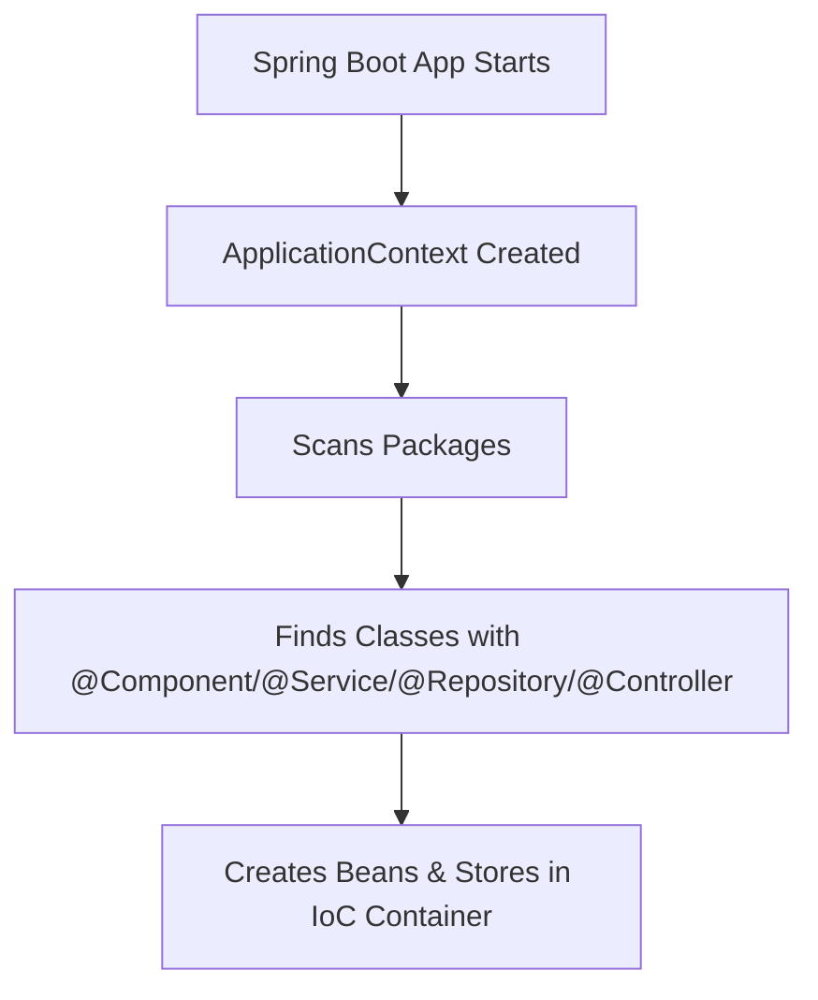

# 🌱 Spring Boot Essentials: Deep Dive into Core Concepts, Annotations, and Project Execution

---

## 🚀 How to Run a Spring Boot Project

To run your Spring Boot project using Maven:

```bash
mvn spring-boot:run -q
```

- `spring-boot:run`: Runs the app via the Spring Boot Maven plugin.
- `-q`: Quiet mode (minimizes log output).

Or run the generated JAR directly:

```bash
java -jar target/your-app-name-0.0.1-SNAPSHOT.jar
```

> ✅ This is a **Fat JAR** — it contains your compiled code, all dependencies, and an embedded server (like Tomcat), allowing it to run as a standalone application.

---

## 🧃 Fat JAR vs Normal JAR

| Feature                  | Normal JAR                     | Fat JAR (Spring Boot default)        |
|--------------------------|--------------------------------|--------------------------------------|
| Dependencies included?   | ❌ Only compiled `.class` files | ✅ Includes all dependencies          |
| Requires external server | ✅ Yes                         | ❌ No (Embedded Tomcat/Jetty)         |
| Runs independently       | ❌ No                          | ✅ Yes                                |

---

## 🧠 Inversion of Control (IoC) and IoC Container

### 🔄 What is IoC?

> IoC means handing over object creation and management to Spring instead of doing it manually.

**Traditional Java:**

```java
UserService service = new UserService();
```

**Spring Boot (using IoC):**

```java
@Autowired
UserService service;
```

Spring handles creation and injection.

---

### 📦 IoC Container

> It's the system Spring uses to manage objects (called beans).

Think of it as a **storage unit** that contains all classes annotated with `@Component`, `@Service`, etc. These are available for injection wherever needed.

---

### 🧠 ApplicationContext

> `ApplicationContext` is the actual implementation of the IoC container in Spring.

It:
- Scans packages for annotated classes
- Creates and manages beans
- Makes them available wherever required



---

## 🧩 Important Spring Boot Annotations

### ✅ `@SpringBootApplication`

Used only once, in the main class. It is the entry point of the Spring Boot application and is equivalent to using:

```java
@Configuration
@EnableAutoConfiguration
@ComponentScan
```

It:
- Marks the class as configuration
- Enables auto configuration
- Tells Spring to scan the package and sub-packages for components

📝 **IMPORTANT NOTE**:  
If your main class is in `package first.testing`, Spring will only scan this package and its sub-packages. Classes outside this structure, even if annotated with `@Component`, will not be managed by Spring unless explicitly scanned.

---

### ✅ `@Component`

Marks a class as a Spring-managed bean.

```java
@Component
public class CarService {
    ...
}
```

Spring will automatically register `CarService` in the ApplicationContext.

---

### ✅ `@Autowired`

Used for dependency injection. Asks Spring to inject the required bean.

```java
@Component
public class Garage {

    @Autowired
    private CarService carService;

}
```

Equivalent to:

```java
CarService carService = new CarService();
```

But handled by Spring internally.

---

### ✅ `@Bean`

Used to define beans explicitly inside a method within a `@Configuration` class.

```java
@Configuration
public class AppConfig {

    @Bean
    public MyBean myBean() {
        return new MyBean();
    }
}
```

🔸 Note: `@Bean` is used only on methods, not on classes.

---

### ✅ `@Configuration`

Indicates that a class can contain `@Bean` definitions.

---

### ✅ `@EnableAutoConfiguration`

Tells Spring Boot to automatically configure beans based on dependencies found in the classpath. For example, if MongoDB dependency is added, it configures `MongoTemplate` automatically.

---

## 🎯 Summary Table

| Annotation             | Purpose                                               | Target        |
|------------------------|-------------------------------------------------------|---------------|
| `@SpringBootApplication` | Main entry point, enables component scanning, auto-config | Class         |
| `@Component`           | Registers class as Spring-managed bean               | Class         |
| `@Autowired`           | Injects dependency automatically                     | Field, Constructor, Setter |
| `@Bean`                | Declares a bean manually inside `@Configuration`     | Method        |
| `@Configuration`       | Declares that the class contains bean definitions    | Class         |
| `@EnableAutoConfiguration` | Enables Spring Boot to configure beans based on dependencies | Class    |

---

## 🧠 Pro Tip

Annotations can be used on:
- Classes (`@Component`, `@Configuration`)
- Methods (`@Bean`)
- Fields (`@Autowired`)
- Interfaces (for meta-annotations or custom annotations)

> Annotations provide metadata. Spring reads these to understand what behavior to apply to your code.

---

## 🧰 Bonus: Troubleshooting Package Scanning

🟡 **Only classes in and under the package of the main class are scanned automatically.**  
If you want to scan classes outside the base package, you can use:

```java
@ComponentScan(basePackages = {"com.example", "org.other"})
```

---

✅ With this knowledge, you can now confidently understand how Spring Boot manages your code structure, configures dependencies, and powers up your project with minimal boilerplate.
