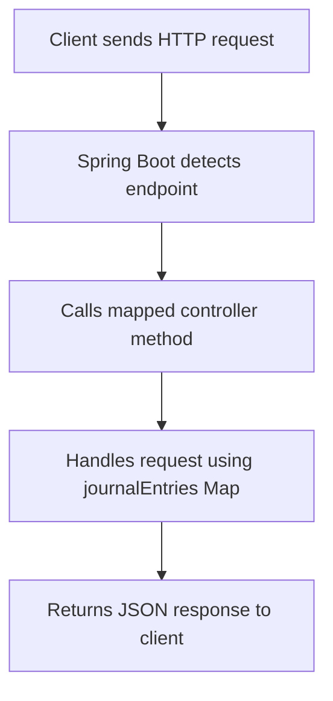

# 📝REST API: CRUD operations using spring boot

## 📁 Project Structure

```
testing.full.stack.journal
├── JournalApplication.java          // Main Spring Boot App class
├── controller
│   └── JournalEntryController.java  // REST Controller with endpoints
├── entity
    └── JournalEntry.java           // Entity model representing a journal
```

---

## 1️⃣ `JournalApplication.java` - Main Entry Point

```java
package testing.full.stack.journal;

import org.springframework.boot.SpringApplication;
import org.springframework.boot.autoconfigure.SpringBootApplication;

@SpringBootApplication
public class JournalApplication {
	public static void main(String[] args) {
		SpringApplication.run(JournalApplication.class, args);
	}
}
```

### 🔍 Explanation

#### ✅ `@SpringBootApplication`
This is a **meta-annotation** that combines:

- `@Configuration`: Marks the class as a source of bean definitions.
- `@EnableAutoConfiguration`: Tells Spring Boot to automatically configure beans based on classpath and properties.
- `@ComponentScan`: Automatically scans sub-packages for classes annotated with `@Component`, `@Service`, `@Repository`, or `@Controller`.

#### ✅ `SpringApplication.run(...)`
This bootstraps your app:
- Starts the Spring context.
- Initializes beans.
- Launches an embedded Tomcat server.

---

## 2️⃣ `JournalEntry.java` - Entity Class

```java
package testing.full.stack.journal.entity;

public class JournalEntry {
    private long id;
    private String title;
    private String content;

    public long getId() { return id; }
    public void setId(long id) { this.id = id; }

    public String getTitle() { return title; }
    public void setTitle(String title) { this.title = title; }

    public String getContent() { return content; }
    public void setContent(String content) { this.content = content; }
}
```

### 🔍 Explanation
A simple **Java POJO (Plain Old Java Object)** with 3 fields:
- `id`: long — uniquely identifies an entry
- `title`: String — title of the note
- `content`: String — actual journal content

We use **getters and setters** for encapsulation.

---

## 3️⃣ `JournalEntryController.java` - REST Controller

```java
package testing.full.stack.journal.Controller;

import org.springframework.web.bind.annotation.*;
import testing.full.stack.journal.entity.JournalEntry;
import java.util.*;

@RestController
@RequestMapping("/journal")
public class JournalEntryController {

    private Map<Long, JournalEntry> journalEntries = new HashMap<>();

    @GetMapping
    public List<JournalEntry> getAll() {
        return new ArrayList<>(journalEntries.values());
    }

    @PostMapping
    public boolean createEntry(@RequestBody JournalEntry myEntry) {
        journalEntries.put(myEntry.getId(), myEntry);
        return true;
    }

    @GetMapping("/id/{myId}")
    public JournalEntry getJournalEntryById(@PathVariable Long myId) {
        return journalEntries.get(myId);
    }

    @DeleteMapping("/id/{myId}")
    public JournalEntry deleteJournalEntryById(@PathVariable long myId) {
        return journalEntries.remove(myId);
    }

    @PutMapping("/id/{id}")
    public JournalEntry updateEntry(@PathVariable long id, @RequestBody JournalEntry myEntry) {
        return journalEntries.put(id, myEntry);
    }
}
```

---

## 🧠 Deep Annotation Guide

### 🧩 `@RestController`
- Combines `@Controller` and `@ResponseBody`
- Indicates that returned values from methods should be written directly to the HTTP response as JSON or XML (default JSON).

### 🧩 `@RequestMapping("/journal")`
- Adds a **base path** to all methods inside the controller.
- All endpoints will begin with `/journal`

### 🧩 `@GetMapping`, `@PostMapping`, `@DeleteMapping`, `@PutMapping`
These are **shortcuts** for `@RequestMapping(method = ...)`:
- `@GetMapping` → Used to fetch data (HTTP GET)
- `@PostMapping` → Used to create new resource (HTTP POST)
- `@PutMapping` → Used to update existing resource (HTTP PUT)
- `@DeleteMapping` → Used to delete resource (HTTP DELETE)

#### 🔍 What Spring does behind the scenes:
- Detects the URL pattern (e.g., `/journal/id/{id}`)
- Matches it with incoming request
- Resolves parameters via annotations like `@PathVariable` or `@RequestBody`
- Executes your Java method
- Converts return value to JSON using Jackson (by default)

### 🧩 `@PathVariable`
- Binds a value from the URL into a method parameter.
- Example: `/journal/id/1` → `@PathVariable Long myId` will be `1`

### 🧩 `@RequestBody`
- Converts JSON in the HTTP request body to a Java object.
- Spring uses **Jackson** behind the scenes to parse JSON.

---

## 📊 REST Endpoints Table

| HTTP | Path               | Method Name          | Purpose                     |
|------|--------------------|----------------------|-----------------------------|
| GET  | `/journal`         | `getAll()`           | Fetch all journal entries   |
| POST | `/journal`         | `createEntry(...)`   | Create a new journal entry  |
| GET  | `/journal/id/{}`   | `getJournalEntryById()` | Fetch entry by ID        |
| DELETE | `/journal/id/{}` | `deleteJournalEntryById()` | Delete entry by ID     |
| PUT  | `/journal/id/{}`   | `updateEntry(...)`   | Update entry by ID          |

---

## 🔄 Flow Chart



---

## ⚠️ Improvements Made

| Original                       | Updated                         |
|-------------------------------|----------------------------------|
| `journalEnties` (typo)        | `journalEntries`                |
| Missing slashes in paths      | Added `/` in `"/id/{...}"`      |
| Poor formatting               | Cleaned code for readability     |
| Explanation missing           | Added deep dive + diagrams       |
| Lack of annotation behavior   | Added internals for each one     |

---

## 📦 Tips to Run This Project

### ▶️ Terminal Commands
```bash
# Build and run the project (Maven)
mvn clean install
mvn spring-boot:run
```

---

## 🧪 Try with Postman / curl

### Create Entry (POST)
```http
POST /journal
Content-Type: application/json

{
  "id": 1,
  "title": "My First Note",
  "content": "Learning Spring Boot"
}
```

### Get All Entries (GET)
```http
GET /journal
```

### Get by ID (GET)
```http
GET /journal/id/1
```

### Delete (DELETE)
```http
DELETE /journal/id/1
```

### Update (PUT)
```http
PUT /journal/id/1
Content-Type: application/json

{
  "id": 1,
  "title": "Updated Note",
  "content": "Updated content"
}
```
---

