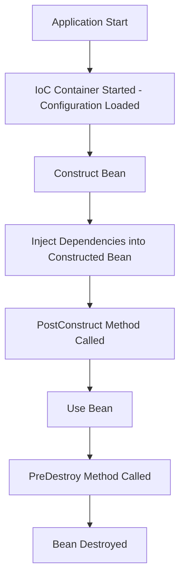

# Spring Boot: Bean Discovery, Creation, and Lifecycle

## 1. How Spring Boot Finds Beans

### Using `@ComponentScan`

* Spring Boot scans the specified package and its sub-packages for classes annotated with `@Component`, `@Service`, `@Repository`, `@Controller`, etc.
* `@SpringBootApplication` internally includes `@ComponentScan`, so beans are automatically discovered in the same package and sub-packages.

### Using `@Configuration`

* Classes annotated with `@Configuration` are also scanned.
* Spring finds methods annotated with `@Bean` and creates beans as defined in the configuration.

---

## 2. How Beans Are Created

### Eager Beans

* Created at the time of application startup.
* Singleton scope beans are eager by default.

Example (`User.java`):

```java
package com.antim.udemySh.service;

import org.springframework.stereotype.Component;

@Component
public class User {
    public User(){
        System.out.println("Bean initialized: user");
    }
}
```

**Runtime Output:**

```
Bean initialized: user
```

This shows that the bean is created when the application context starts.

### Lazy Beans

* Created only when they are first requested or injected.
* Useful for resource-intensive beans.

Example (`Order.java`):

```java
package com.antim.udemySh.service;

import org.springframework.context.annotation.Lazy;
import org.springframework.stereotype.Component;

@Lazy
@Component
public class Order {
    public Order(){
        System.out.println("Lazy: initializing order");
    }
}
```

Injection in another bean:

```java
@Autowired
Order order;
```

**Runtime Output:**

```
Bean initialized: user
Lazy: initializing order
```

* Eager beans are created first, then lazy beans when needed.

---

## 3. Bean Lifecycle Annotations

### `@PostConstruct`

* Used to perform tasks after the bean has been constructed and dependencies injected.
* Spring automatically calls this method; you don’t need to invoke it manually.

Example:

```java
@Autowired
Order order;

@PostConstruct
public void initialize(){
    System.out.println("Beans has been constructed");
}
```

**Runtime Output:**

```
Bean initialized: user
Lazy: initializing order
Beans has been constructed
```

### `@PreDestroy`

* Used to perform tasks before a bean is destroyed (e.g., closing DB connections).
* Triggered when the application context is closed.

Example:

```java
@PreDestroy
public void preDestroy(){
    System.out.println("Bean Destructed");
}
```

Forcing Spring Boot to close the context:

```java
package com.antim.udemySh;

import org.springframework.boot.SpringApplication;
import org.springframework.boot.autoconfigure.SpringBootApplication;
import org.springframework.context.ConfigurableApplicationContext;

@SpringBootApplication
public class EntryPointOfUdemySh {
    public static void main(String[] args){
        ConfigurableApplicationContext context = SpringApplication.run(EntryPointOfUdemySh.class,args);
        context.close();
    }
}
```

**Runtime Output:**

```
Bean initialized: user
Lazy: initializing order
Beans has been constructed
Bean Destructed
```


# Bean Lifecycle


