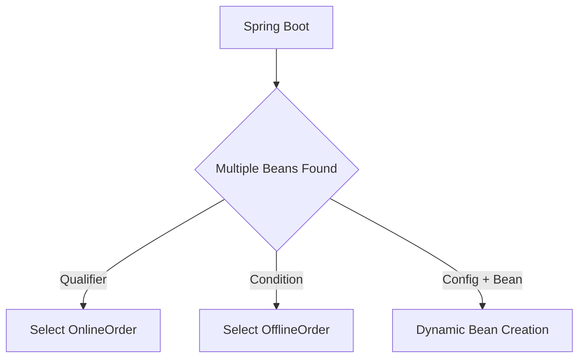

# Spring Bean Ambiguity and Qualifiers in Depth

This document refines and expands your notes into a **well-structured, explained, and readable Markdown guide**. It covers every point you provided, adds clarifications, and includes class names with explanations for better readability.

---

## Problem Statement

We have two child classes (`OnlineOrder` and `OfflineOrder`) implementing a common interface (`Order`). Spring Boot (SB) gets confused because it does not know which bean to create when multiple beans of the same type exist.

---

## Classes and Code Walkthrough

### 1. `Order.java` (Interface)

```java
package com.antim.udemySh.service;

import org.springframework.stereotype.Component;

@Component
public interface Order {
    public void createOrder();
}
```

**Explanation:**

* This is an interface representing an order.
* It is marked with `@Component`, but this is not necessary (interfaces usually shouldn’t be `@Component`).
* Both child classes (`OnlineOrder` and `OfflineOrder`) will implement this interface.

---

### 2. `OnlineOrder.java`

```java
package com.antim.udemySh.service;

import org.springframework.beans.factory.annotation.Qualifier;
import org.springframework.stereotype.Component;

@Component
@Qualifier("onlineOrderObj")
public class OnlineOrder implements Order {
    public OnlineOrder(){
        System.out.println("Online order");
    }

    public void createOrder(){
        System.out.println("creating order");
    }
}
```

**Explanation:**

* Marked with `@Component`, so Spring registers this class as a bean.
* `@Qualifier("onlineOrderObj")` gives it a unique identifier.
* Without `@Qualifier`, Spring won’t know which `Order` bean to use when injecting.

---

### 3. `OfflineOrder.java`

```java
package com.antim.udemySh.service;

import org.springframework.beans.factory.annotation.Qualifier;
import org.springframework.stereotype.Component;

@Component
@Qualifier("offlineOrderObj")
public class OfflineOrder implements Order {
    public OfflineOrder(){
        System.out.println("Offline order");
    }

    public void createOrder(){
        System.out.println("creating order");
    }
}
```

**Explanation:**

* Works the same way as `OnlineOrder`.
* Registered with a different qualifier (`offlineOrderObj`).

---

## Problem Output (Without Qualifier)

If we try to inject `Order` directly, we get:

```
Error: Field order in com.antim.udemySh.service.User required a bean of type 'com.antim.udemySh.service.Order' that could not be found.
```

This happens because Spring finds **two beans** (`OnlineOrder`, `OfflineOrder`) implementing `Order`, so it doesn’t know which one to inject.

---

## Solution 1: Use `@Qualifier`

### `User.java`

```java
package com.antim.udemySh.service;

import jakarta.annotation.PostConstruct;
import org.springframework.beans.factory.annotation.Autowired;
import org.springframework.beans.factory.annotation.Qualifier;
import org.springframework.stereotype.Component;

@Component
public class User {
    @Qualifier("onlineOrderObj")
    @Autowired
    Order order;

    public User(){
        System.out.println("User initialized ");
    }

    @PostConstruct
    public void makeOrder(){
        order.createOrder();
    }
}
```

### Output:

```
User initialized
Online order
creating order
Offline order
```

**Explanation:**

* By using `@Qualifier`, we explicitly tell Spring which bean to inject.
* Both beans are still created (because both are marked `@Component`).
* But only the one with the chosen `@Qualifier` is injected.

---

## Solution 2: Dynamic Bean Selection with Condition

Instead of hardcoding the qualifier, we can inject both beans and decide at runtime.

### `User.java` (Dynamic Example)

```java
package com.antim.udemySh.service;

import jakarta.annotation.PostConstruct;
import org.springframework.beans.factory.annotation.Autowired;
import org.springframework.beans.factory.annotation.Qualifier;
import org.springframework.stereotype.Component;

@Component
public class User {
    @Qualifier("onlineOrderObj")
    @Autowired
    Order onlineOrder;

    @Qualifier("offlineOrderObj")
    @Autowired
    Order offlineOrder;

    public User(){
        System.out.println("User initialized ");
    }

    @PostConstruct
    public void makeOrder(){
        // Dynamic selection (in real case, could come from DB, API, or config)
        String type = "offline";
        if(type.equals("online")){
            onlineOrder.createOrder();
        } else {
            offlineOrder.createOrder();
        }
    }
}
```

### Output:

```
User initialized
Online order
creating order
Offline order
```

**Explanation:**

* Both beans are injected separately.
* Logic inside the method decides which one to use.
* This avoids hardcoding the bean selection.

---

## Solution 3: Using `@Value` with `@Configuration` + `@Bean`

Instead of relying on `@Component` scanning, we can manually configure beans with logic.

### `application.properties`

```properties
isOnlineOrder=true
```

### `User.java`

```java
package com.antim.udemySh.service;

import org.springframework.beans.factory.annotation.Autowired;
import org.springframework.stereotype.Component;

@Component
public class User {
    @Autowired
    Order order;

    public void createOrder(){
        order.createOrder();
    }
}
```

### `OnlineOrder.java`

```java
package com.antim.udemySh.service;

public class OnlineOrder implements Order {
    public OnlineOrder(){
        System.out.println("Online order");
    }

    public void createOrder(){
        System.out.println("creating order");
    }
}
```

### `OfflineOrder.java`

```java
package com.antim.udemySh.service;

public class OfflineOrder implements Order {
    public OfflineOrder(){
        System.out.println("Offline order");
    }

    public void createOrder(){
        System.out.println("creating order");
    }
}
```

### `Test.java` (Configuration Class)

```java
package com.antim.udemySh.service;

import org.springframework.beans.factory.annotation.Value;
import org.springframework.context.annotation.Bean;
import org.springframework.context.annotation.Configuration;

@Configuration
public class Test {
    @Bean
    public Order makeOrder(@Value("${isOnlineOrder}") boolean isOnlineOrder){
        if(isOnlineOrder){
            return new OnlineOrder();
        } else {
            return new OfflineOrder();
        }
    }
}
```

**Explanation:**

* `@Configuration` + `@Bean` = explicit bean factory.
* The bean is created conditionally based on the property value.
* This avoids creating unused beans (unlike `@Component` approach).

---

## Why Not Use `@Component` with `@Configuration + @Bean`?

This is a **very common confusion**. Let’s break it down:

### 🔹 `@Component`

* Tells Spring: *“this class itself is a bean”*.
* Example:

  ```java
  @Component
  public class OnlineOrder implements Order {}
  ```

### 🔹 `@Configuration + @Bean`

* `@Configuration`: marks a class as a factory that produces beans.
* `@Bean`: defines a bean method inside the factory.
* Example:

  ```java
  @Configuration
  public class AppConfig {
      @Bean
      public Order order(){
          return new OnlineOrder();
      }
  }
  ```

### ❌ Problem if Both Used Together

```java
@Component
public class OnlineOrder implements Order {}

@Configuration
public class AppConfig {
    @Bean
    public Order order(){
        return new OnlineOrder();
    }
}
```

➡ Spring now sees **two beans of type `Order`** → `NoUniqueBeanDefinitionException`.

### ✅ Rule of Thumb

* Use `@Component` → when class is simple and can be auto-scanned.
* Use `@Configuration + @Bean` → when bean creation depends on logic (e.g., conditions, 3rd party classes).
* **Never use both at the same time** for the same class.

---

## Visual Representation (Bean Resolution)



---

## Final Key Takeaways

1. If multiple beans of the same type exist → ambiguity occurs.
2. Use `@Qualifier` to resolve conflicts.
3. Use dynamic injection (`if/else`) when the bean depends on runtime conditions.
4. Use `@Value + @Configuration + @Bean` for conditional or externalized configurations.
5. Do **not** mix `@Component` with `@Bean` for the same class.
6. Rule of Thumb:

   * `@Component` → for auto-detected beans.
   * `@Bean` → for conditional/custom beans.
