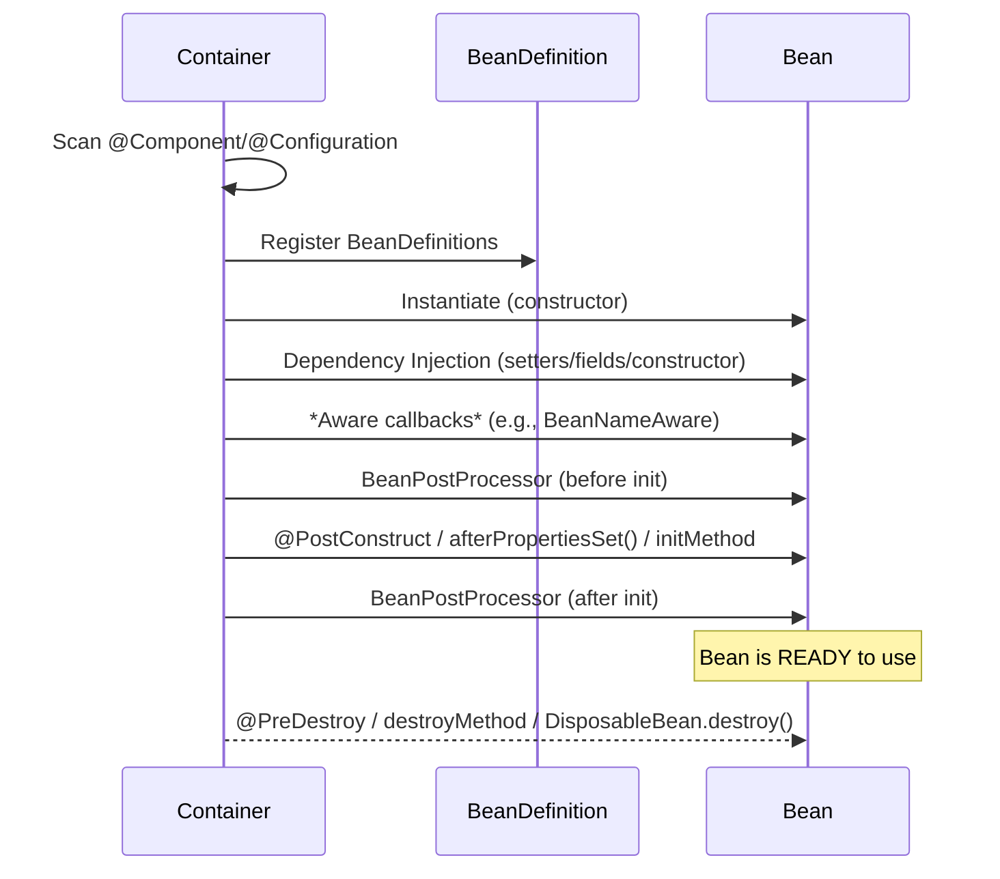
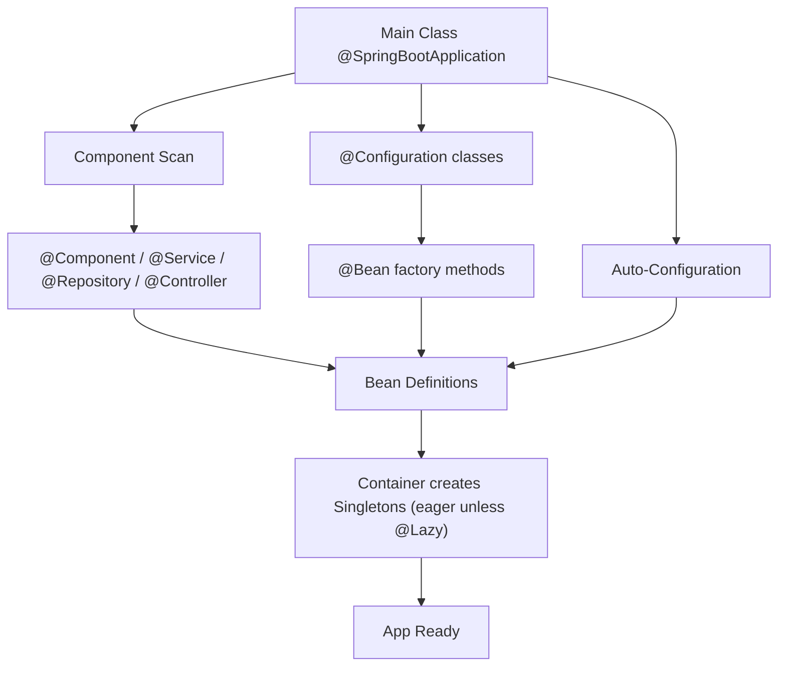
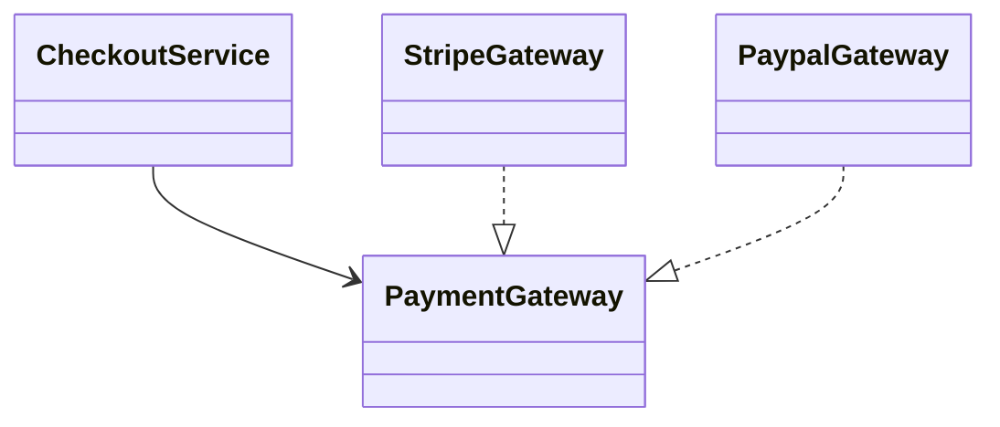

# Spring Beans — A Deep Dive 


## What is a Bean?
A **Spring Bean** is any Java object that is **created, configured, and managed by the Spring IoC container** (`ApplicationContext`).

- You write **plain Java classes**.
- Spring creates the objects (beans), wires their dependencies, manages their lifecycle, and exposes them for use throughout the app.

**Key players**
- **IoC Container**: Creates and manages beans. In Spring Boot you typically use `ApplicationContext`.
- **Configuration Metadata**: Where beans come from (component scanning, `@Configuration` + `@Bean`, auto-configuration, etc.).

---

## 🏗️ Ways to Define/Discover Beans

### 1) Stereotype Annotations (Component Scanning)
Use **convention over configuration**: mark classes so the scanner picks them up.

- `@Component` – generic component
- `@Service` – service/business logic (same as `@Component`, plus semantic meaning)
- `@Repository` – persistence/DAO (adds exception translation)
- `@Controller` / `@RestController` – MVC/web controllers

```java
import org.springframework.stereotype.Component;

@Component
public class PaymentGateway {
    private final HttpClient client = HttpClient.newHttpClient();
}
```

> ✅ **Correction to a common myth**: With `@Component`, you **can** have a parameterized constructor. Spring will perform **constructor injection** automatically if it can resolve the dependencies.

```java
@Component
public class InvoiceService {
    private final PaymentGateway gateway;

    // Spring injects this dependency
    public InvoiceService(PaymentGateway gateway) {
        this.gateway = gateway;
    }
}
```

### 2) Java Config: `@Configuration` + `@Bean`
Define beans explicitly via factory methods.

```java
import org.springframework.context.annotation.*;

@Configuration
public class AppConfig {

    @Bean
    public PaymentGateway gateway() {              // bean name = "gateway"
        return new PaymentGateway();
    }

    @Bean
    public InvoiceService invoiceService(PaymentGateway gateway) {
        // Dependencies can appear as parameters — Spring injects them
        return new InvoiceService(gateway);
    }
}
```

**When to use**
- You need to pass **constructor arguments** that aren’t beans (e.g., external settings or complex factory logic).
- You want a **single place** that defines how a dependency is built (e.g., third‑party SDK clients).

**Advanced**
- `@Configuration(proxyBeanMethods = true)` (default) uses CGLIB to ensure bean singletons even when calling `@Bean` methods from inside the config class. Set to `false` for performance when you don’t do method-to-method bean calls.

### 3) Auto-Configuration (Starters)
With Spring Boot starters, many beans are created automatically using `@Conditional` rules (e.g., embedded Tomcat, Jackson `ObjectMapper`). You usually customize via `application.properties` instead of manual bean definitions.

---

## 🔎 How Spring Finds Beans

### Component Scanning with `@ComponentScan`
- `@SpringBootApplication` **includes** `@ComponentScan`.
- By default, it scans the **package of your main class and all sub-packages**.

```java
@SpringBootApplication
public class DemoApplication { /* ... */ }
```

Customize scan roots:
```java
@SpringBootApplication
@ComponentScan(basePackages = {"com.example.payments", "com.example.users"})
public class DemoApplication { }
```

### Configuration Classes
- The container also looks for `@Configuration` classes and registers any `@Bean` methods they contain.

---

## ⏱️ When Are Beans Created? (Eager vs Lazy)

- **Singleton** scope beans (default) are created **eagerly at context refresh** (startup).
- Mark a bean **`@Lazy`** to create it **only when first requested**.
- **Prototype** scope beans are created **every time** they are requested.

```java
@Component
class UserService { /* eager singleton by default */ }

@Component
@Lazy
class AuditClient { /* created only when first injected/used */ }
```

### Example: Eager + Lazy Dependency
```java
@Component
class OrderService {
    private final PaymentGateway gateway; // lazy dep

    public OrderService(@Lazy PaymentGateway gateway) { // lazy just for this dependency
        this.gateway = gateway;
    }
}
```

---

## 📦 Bean Scopes

| Scope         | Lifecycle / Creation Time                      | Visibility            | Typical Use Case |
|---------------|--------------------------------------------------|-----------------------|------------------|
| `singleton`   | One instance per container (default). Eager unless `@Lazy`. | App-wide              | Services, repositories |
| `prototype`   | New instance **every injection/request**.       | Requesting bean only  | State‑full helpers |
| `request`     | One per HTTP request                            | Web request           | Request context data |
| `session`     | One per HTTP session                            | User session          | Session data |
| `application` | One per `ServletContext`                        | Web application       | Shared web resources |
| `websocket`   | One per WebSocket session                       | WebSocket session     | Per-connection state |

```java
@Scope(ConfigurableBeanFactory.SCOPE_PROTOTYPE)
@Component
class TemporaryBuffer { }
```

---

## 🔗 Dependency Injection (DI)

**Preferred**: **Constructor injection** — makes dependencies explicit, supports immutability, best for testing.

```java
@Component
class ReportService {
    private final UserRepository repo;

    public ReportService(UserRepository repo) { // @Autowired optional on a sole constructor
        this.repo = repo;
    }
}
```

Other styles
- **Setter injection** (optional dependencies):
```java
@Component
class Mailer {
    private SmtpClient client;
    @Autowired
    public void setClient(SmtpClient client) { this.client = client; }
}
```
- **Field injection** (discouraged): harder to test, no immutability.

**Multiple candidates?** Use `@Primary` or `@Qualifier`.
```java
@Component("stripeGateway") class StripeGateway implements PaymentGateway {}
@Component("paypalGateway") class PaypalGateway implements PaymentGateway {}

@Component
class CheckoutService {
    private final PaymentGateway gateway;
    public CheckoutService(@Qualifier("stripeGateway") PaymentGateway gateway) {
        this.gateway = gateway;
    }
}
```

---

## ♻️ Bean Lifecycle (Step-by-step)



### Lifecycle Hooks (choose what you need)
- **`@PostConstruct`** (JSR‑250): run code **after DI** and before the bean is ready.
- **`InitializingBean#afterPropertiesSet()`**: interface callback alternative.
- **`@Bean(initMethod="m", destroyMethod="n")`**: configure lifecycle methods in `@Configuration`.
- **`BeanPostProcessor`**: cross-cutting customization for **all** beans (e.g., proxies).
- **`@PreDestroy`** / **`DisposableBean#destroy()`**: cleanup before shutdown.

```java
@Component
class CacheManager implements InitializingBean, DisposableBean {
    @Override public void afterPropertiesSet() { /* warm up */ }
    @Override public void destroy() { /* flush & close */ }

    @PostConstruct
    void postConstruct() { /* telemetry */ }

    @PreDestroy
    void preDestroy() { /* emit metrics */ }
}
```

---

## 🧪 Putting It Together (User ↔ Order example with `@Lazy`)

```java
@Component
class OrderService {
    private final UserService userService;
    private final AuditClient auditClient; // lazy

    OrderService(UserService userService, @Lazy AuditClient auditClient) {
        this.userService = userService;
        this.auditClient = auditClient; // not created until used
    }

    public void placeOrder(String userId) {
        var user = userService.find(userId);
        // ... business logic
        auditClient.record("order", userId); // triggers lazy bean creation
    }
}

@Component
class UserService { /* eager singleton */ }

@Component
@Lazy
class AuditClient { /* heavy SDK client; construct on demand */ }
```

**Flow**
1. On startup, `UserService` and `OrderService` (singletons) are created.
2. `AuditClient` is not created because it’s **lazy**.
3. First call to `placeOrder` triggers `auditClient` creation.

---

## 🧰 `@Bean` vs `@Component` vs `@Configuration` — When to Use What?

| Use Case | `@Component` | `@Bean` (in `@Configuration`) |
|---|---|---|
| You control the class source code | ✅ Just annotate the class | ✅ Possible, but unnecessary |
| Third‑party class (e.g., SDK) | ❌ Not possible | ✅ Define factory method |
| Need custom constructor args not available as beans | ⚠️ Possible only if args are beans | ✅ Full control over arguments |
| Centralized object construction logic | ⚠️ | ✅ |
| Simple service/repository/controller | ✅ | ⚠️ Overkill |

> **Name clashes and precedence**: If two beans of the **same name** exist, which one wins depends on configuration (`spring.main.allow-bean-definition-overriding=true`), `@Primary`, and `@Qualifier`. Prefer **unique names** or explicit qualifiers.

```java
@Configuration
class ClientConfig {
    @Bean(name = "paymentGateway")
    public PaymentGateway paymentGateway() { return new StripeGateway(); }
}

@Component("paymentGateway")
class PaypalGateway implements PaymentGateway {}

// If overriding is disabled (default in many Boot versions), the context fails to start due to duplicate bean name.
// Use unique names or @Qualifier to disambiguate.
```

---

## 🧭 Visuals

### 1) Startup & Discovery Flow


### 2) Dependency Graph (example)


---

## 🧠 FAQ (Based on your notes)

**Q: Can `@Component` use a parameterized constructor?**  
**A:** Yes. Spring will perform **constructor injection** if it can resolve the dependencies as beans.

**Q: Which is prioritized: `@Component` or `@Bean`?**  
**A:** There’s no universal priority. It depends on **bean names**, Boot’s **override setting**, and `@Primary/@Qualifier`. Avoid conflicts by giving **unique names** and using qualifiers.

**Q: When do beans get created?**  
**A:** At **context refresh** (startup) for singletons unless `@Lazy`. Prototypes are created on request; web scopes (`request`, `session`, …) are tied to the HTTP lifecycle.

**Q: How many beans are created if I declare multiple `@Bean` methods?**  
**A:** One **bean instance per `@Bean` method** (per scope). Each method defines a distinct bean.

**Q: What are the 3 DI styles?**  
**A:** Constructor (✅ preferred), setter (optional deps), field (❌ avoid).

---

## 📑 Cheat Sheet

- **Create**: `@Component` (auto), or `@Bean` factory methods in `@Configuration`.
- **Scan**: `@ComponentScan` or rely on `@SpringBootApplication` default scanning.
- **Scope**: default `singleton`; use `@Scope("prototype")`, web scopes, and `@Lazy` as needed.
- **Inject**: Prefer **constructor injection**; disambiguate with `@Qualifier` / `@Primary`.
- **Lifecycle**: `@PostConstruct` → ready → `@PreDestroy` (plus `initMethod`/`destroyMethod`).
- **Avoid**: field injection, duplicate names, tight coupling to concrete classes.

---

## 📎 Full Working Demo (minimal)

**`DemoApplication.java`**
```java
@SpringBootApplication
public class DemoApplication {
    public static void main(String[] args) { SpringApplication.run(DemoApplication.class, args); }
}
```

**`AppConfig.java`**
```java
@Configuration
public class AppConfig {
    @Bean
    public Clock clock() { return Clock.systemUTC(); }
}
```

**`AuditClient.java`**
```java
@Component
@Lazy
public class AuditClient {
    public void record(String type, String id) { /* ... */ }
}
```

**`CheckoutService.java`**
```java
@Service
public class CheckoutService {
    private final Clock clock;        // from @Bean
    private final AuditClient audit;  // @Lazy component

    public CheckoutService(Clock clock, AuditClient audit) {
        this.clock = clock;
        this.audit = audit;
    }

    public void checkout(String orderId) {
        // uses clock immediately; audit created only when first used
        audit.record("order", orderId);
    }
}
```

**`application.properties`**
```properties
spring.main.lazy-initialization=false   # eager singletons by default
```

---
