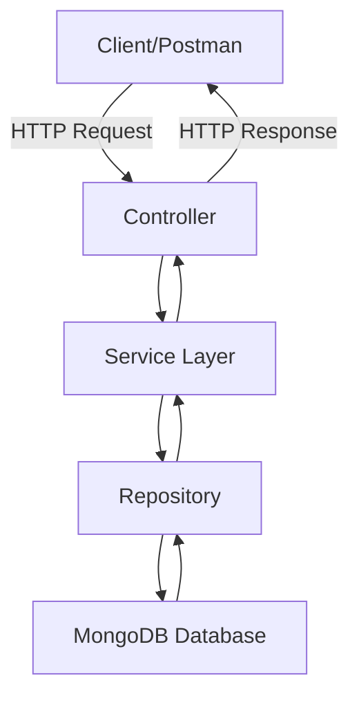
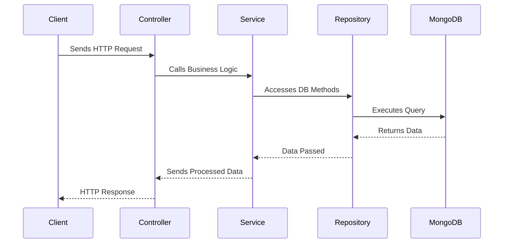

# 🚀 Spring Boot + MongoDB — Complete CRUD Guid

## 🌱 1. What Are We Building?

We are building a **Spring Boot REST API** that connects to **MongoDB** and supports CRUD operations:

- Add a user  
- Get all users  
- Get user by ID  
- Delete a user  

**Stack used:**
- Spring Boot (Java framework)
- MongoDB (NoSQL database)

---

## 🏗️ 2. Project Structure

```
fromBasics
 ┣ src/main/java/com/antim/fromBasics
 ┃ ┣ controller      # Handles HTTP requests
 ┃ ┣ service         # Business logic
 ┃ ┣ repository      # Database interaction
 ┃ ┗ model           # Entity class
 ┗ src/main/resources
   ┗ application.properties
```

---

## ⚙️ 3. MongoDB Configuration

In `src/main/resources/application.properties`:

```properties
spring.application.name=fromBasics
server.port=8080

spring.data.mongodb.database=antimDB
spring.data.mongodb.host=localhost
spring.data.mongodb.port=27017
```

This tells Spring Boot how to connect to MongoDB.

---

## 🔄 4. The Flow of a Request

Here’s how data flows when a client makes an API request:



- **Controller** → Receives HTTP request (REST endpoint).  
- **Service** → Executes business logic.  
- **Repository** → Talks to MongoDB.  
- **Database** → Stores/returns data.  

---

## 🧱 5. Model (Entity Class)

`src/main/java/com/antim/fromBasics/model/User.java`

```java
package com.antim.fromBasics.model;

import org.springframework.data.annotation.Id;
import org.springframework.data.mongodb.core.mapping.Document;

@Document(collection = "users") // Maps this class to MongoDB "users" collection
public class User {
    @Id
    private String id;   // Primary key
    private String name;
    private String email;

    // Constructor
    public User() {}
    public User(String id, String name, String email) {
        this.id = id;
        this.name = name;
        this.email = email;
    }

    // Getters and Setters
    public String getId() { return id; }
    public void setId(String id) { this.id = id; }

    public String getName() { return name; }
    public void setName(String name) { this.name = name; }

    public String getEmail() { return email; }
    public void setEmail(String email) { this.email = email; }
}
```

---

## 📚 6. Repository (Data Access Layer)

`src/main/java/com/antim/fromBasics/repository/UserRepository.java`

```java
package com.antim.fromBasics.repository;

import com.antim.fromBasics.model.User;
import org.springframework.data.mongodb.repository.MongoRepository;
import org.springframework.stereotype.Repository;

@Repository
public interface UserRepository extends MongoRepository<User, String> {
}
```

✅ Spring Data MongoDB automatically gives us methods like:
- `save()`  
- `findAll()`  
- `findById()`  
- `deleteById()`  

---

## 🧠 7. Service Layer (Business Logic)

`src/main/java/com/antim/fromBasics/service/UserService.java`

```java
package com.antim.fromBasics.service;

import com.antim.fromBasics.model.User;
import com.antim.fromBasics.repository.UserRepository;
import org.springframework.beans.factory.annotation.Autowired;
import org.springframework.stereotype.Service;

import java.util.List;
import java.util.Optional;

@Service
public class UserService {
    @Autowired
    private UserRepository userRepository;

    // Save user
    public User saveUser(User user) {
        return userRepository.save(user);
    }

    // Get all users
    public List<User> getAllUsers() {
        return userRepository.findAll();
    }

    // Get user by id
    public Optional<User> getUserById(String id) {
        return userRepository.findById(id);
    }

    // Delete user
    public void deleteUser(String id) {
        userRepository.deleteById(id);
    }
}
```

---

## 🌍 8. Controller (API Endpoints)

`src/main/java/com/antim/fromBasics/controller/UserController.java`

```java
package com.antim.fromBasics.controller;

import com.antim.fromBasics.model.User;
import com.antim.fromBasics.service.UserService;
import org.springframework.beans.factory.annotation.Autowired;
import org.springframework.web.bind.annotation.*;

import java.util.List;
import java.util.Optional;

@RestController
@RequestMapping("/users")
public class UserController {
    @Autowired
    private UserService userService;

    // Create user
    @PostMapping
    public User createUser(@RequestBody User user) {
        return userService.saveUser(user);
    }

    // Get all users
    @GetMapping
    public List<User> getAllUsers() {
        return userService.getAllUsers();
    }

    // Get user by ID
    @GetMapping("/{id}")
    public Optional<User> getUserById(@PathVariable String id) {
        return userService.getUserById(id);
    }

    // Delete user
    @DeleteMapping("/{id}")
    public String deleteUser(@PathVariable String id) {
        userService.deleteUser(id);
        return "User with id: " + id + " deleted successfully";
    }
}
```

---

## 🧪 9. Testing with Postman

1. **POST** → `http://localhost:8080/users`  
   ```json
   {
     "name": "Antim",
     "email": "antim@example.com"
   }
   ```

2. **GET all users** → `http://localhost:8080/users`  

3. **GET by id** → `http://localhost:8080/users/<id>`  

4. **DELETE** → `http://localhost:8080/users/<id>`  

---

## 📊 10. High-Level Flow



---

## ✅ 11. Summary

- **Model** → Maps to MongoDB collection.  
- **Repository** → Provides CRUD methods.  
- **Service** → Handles business logic.  
- **Controller** → Exposes REST API.  
- **Testing** → Done via Postman (CRUD endpoints).  


