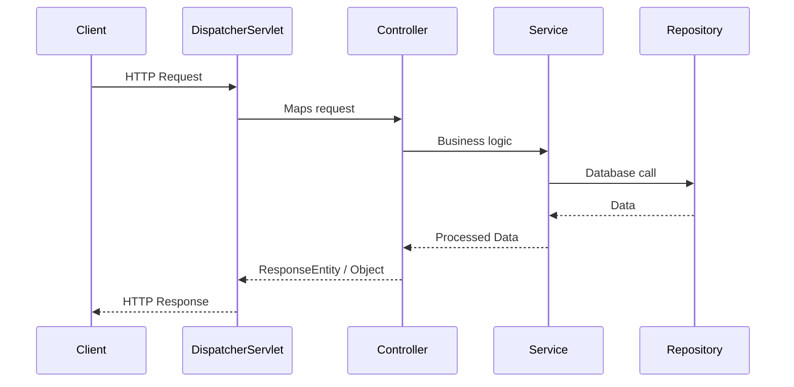

# Spring Boot – From Basics to Advanced

## 📂 Project Structure

A typical Spring Boot project looks like this:

```
project-root/
 ├── .mvn/                  # Maven wrapper support
 ├── mvnw / mvnw.cmd        # Maven wrapper scripts (Linux/Mac & Windows)
 ├── pom.xml                # Project Object Model (dependencies & configs)
 ├── src/
 │    ├── main/
 │    │    ├── java/        # Java source code
 │    │    │    └── com.example.demo/   # Main package (with entry point)
 │    │    │         └── DemoApplication.java
 │    │    └── resources/   # Non-Java resources
 │    │         ├── application.properties (or .yml)
 │    │         └── static/ , templates/
 │    └── test/             # Unit and integration tests
```

---

## 📦 Dependency Management (Maven)

Dependencies are managed in **`pom.xml`**. Example:

```xml
<dependency>
    <groupId>org.springframework.boot</groupId>
    <artifactId>spring-boot-starter-web</artifactId>
</dependency>
```

Build and install locally:

```bash
mvn clean install
```

- `clean` → removes old build files
- `install` → builds a fresh JAR, runs tests, and installs in the local repo

---

## ⚙️ Configuration with `application.properties`

```properties
spring.application.name=store
server.port=8081
```

Inject values using `@Value`:

```java
import org.springframework.beans.factory.annotation.Value;
import org.springframework.web.bind.annotation.RestController;

@RestController
public class AppController {

    @Value("${spring.application.name}")
    private String appName;

    @GetMapping("/app")
    public String getAppName() {
        return "Application Name: " + appName;
    }
}
```

👉 `@Value` can fetch values from **properties files, environment variables, system properties, SpEL expressions, or hardcoded defaults**.

---

## 🧩 Core Annotations

| Annotation          | Purpose |
|---------------------|---------|
| `@Controller`       | Handles HTTP requests, typically returning a view |
| `@RestController`   | Combines `@Controller` + `@ResponseBody`, returning JSON/XML directly |
| `@ResponseBody`     | Indicates the return value is the HTTP response body |
| `@RequestMapping`   | Maps URLs to controller methods (supports GET/POST/PUT/DELETE) |
| `@GetMapping`       | Shortcut for `@RequestMapping(method = GET)` |
| `@PostMapping`      | Shortcut for `@RequestMapping(method = POST)` |
| `@PathVariable`     | Extracts values from the URL path |
| `@RequestParam`     | Extracts query parameters |
| `@RequestBody`      | Maps JSON body to a Java object |
| `@ResponseEntity`   | Represents full HTTP response (status, headers, body) |

---
## 🧩 Core Annotations with Examples

### `@Controller`
- **Purpose**: Marks a class as a controller that handles web requests and returns views.
- **Features**:
  - Used in MVC architecture.
  - Typically returns HTML, JSP, or Thymeleaf templates.
- **Example**:
```java
@Controller
public class HomeController {
    @RequestMapping("/")
    public String home() {
        return "index"; // Resolves index.html or index.jsp
    }
}
```

---

### `@RestController`
- **Purpose**: Combines `@Controller` + `@ResponseBody`.
- **Features**:
  - Directly returns JSON/XML responses.
  - Commonly used for REST APIs.
- **Example**:
```java
@RestController
public class HelloController {
    @GetMapping("/hello")
    public String hello() {
        return "Hello, Spring Boot!";
    }
}
```

---

### `@ResponseBody`
- **Purpose**: Binds return value directly to the HTTP response body.
- **Features**:
  - Skips view resolution.
  - Returns text, JSON, or XML.
- **Example**:
```java
@Controller
public class ResponseDemo {
    @ResponseBody
    @GetMapping("/text")
    public String plainText() {
        return "This is a plain text response.";
    }
}
```

---

### `@RequestMapping`
- **Purpose**: Maps requests to handler methods.
- **Features**:
  - Can specify path, HTTP method, headers, params.
  - Versatile but verbose.
- **Example**:
```java
@RestController
@RequestMapping("/api")
public class MappingController {

    @RequestMapping(value = "/greet", method = RequestMethod.GET)
    public String greet() {
        return "Greetings!";
    }
}
```

---

### `@GetMapping`
- **Purpose**: Shortcut for `@RequestMapping(method = GET)`.
- **Example**:
```java
@GetMapping("/data")
public String getData() {
    return "Fetching data...";
}
```

---

### `@PostMapping`
- **Purpose**: Shortcut for `@RequestMapping(method = POST)`.
- **Example**:
```java
@PostMapping("/save")
public String saveData(@RequestBody String data) {
    return "Saved: " + data;
}
```

---

### `@PutMapping`
- **Purpose**: Shortcut for `@RequestMapping(method = PUT)`.
- **Example**:
```java
@PutMapping("/update/{id}")
public String updateData(@PathVariable int id, @RequestBody String data) {
    return "Updated ID: " + id + " with Data: " + data;
}
```

---

### `@DeleteMapping`
- **Purpose**: Shortcut for `@RequestMapping(method = DELETE)`.
- **Example**:
```java
@DeleteMapping("/delete/{id}")
public String deleteData(@PathVariable int id) {
    return "Deleted ID: " + id;
}
```

---

### `@PathVariable`
- **Purpose**: Extracts values from URI template.
- **Example**:
```java
@GetMapping("/user/{id}")
public String getUser(@PathVariable int id) {
    return "User with ID: " + id;
}
```

---

### `@RequestParam`
- **Purpose**: Extracts query parameters.
- **Features**:
  - Supports default values and optional params.
- **Example**:
```java
@GetMapping("/search")
public String search(@RequestParam(defaultValue = "all") String query) {
    return "Searching for: " + query;
}
```

---

### `@RequestBody`
- **Purpose**: Maps JSON body to Java object.
- **Example**:
```java
@PostMapping("/add-user")
public String addUser(@RequestBody User user) {
    return "User added: " + user.getName();
}
```

---

### `@ResponseEntity`
- **Purpose**: Represents the full HTTP response.
- **Features**:
  - Allows status, headers, and body.
- **Example**:
```java
@GetMapping("/custom-response")
public ResponseEntity<String> customResponse() {
    return ResponseEntity
            .status(HttpStatus.CREATED)
            .header("Custom-Header", "SpringBoot")
            .body("Custom Response Body");
}
```

---

## 🛠 Request Processing Diagram



---

## 🔑 Advanced Topics

### 1. `@InitBinder`
Used for preprocessing request parameters (e.g., converting a `String` date to `LocalDate`).

```java
@InitBinder
public void initBinder(WebDataBinder binder) {
    binder.registerCustomEditor(LocalDate.class, new PropertyEditorSupport() {
        @Override
        public void setAsText(String text) {
            setValue(LocalDate.parse(text, DateTimeFormatter.ofPattern("dd/MM/yyyy")));
        }
    });
}
```

### 2. `ResponseEntity`

```java
@GetMapping("/custom-response")
public ResponseEntity<String> customResponse() {
    return ResponseEntity
            .status(HttpStatus.CREATED)
            .header("Custom-Header", "SpringBoot")
            .body("Custom Response Body");
}
```

---

## ✅ Summary
- Spring Boot simplifies project setup with **convention over configuration**.
- Dependencies are managed via **Maven (`pom.xml`)**.
- Use `application.properties` (or YAML) for configurations.
- **Annotations** like `@RestController`, `@GetMapping`, and `@RequestBody` drive API development.
- `ResponseEntity` gives fine-grained control over HTTP responses.
- Spring Boot automates much of the boilerplate, letting you focus on **business logic**.

---

🚀 With these foundations, you can now build **REST APIs, microservices, and enterprise-grade applications** using Spring Boot!
